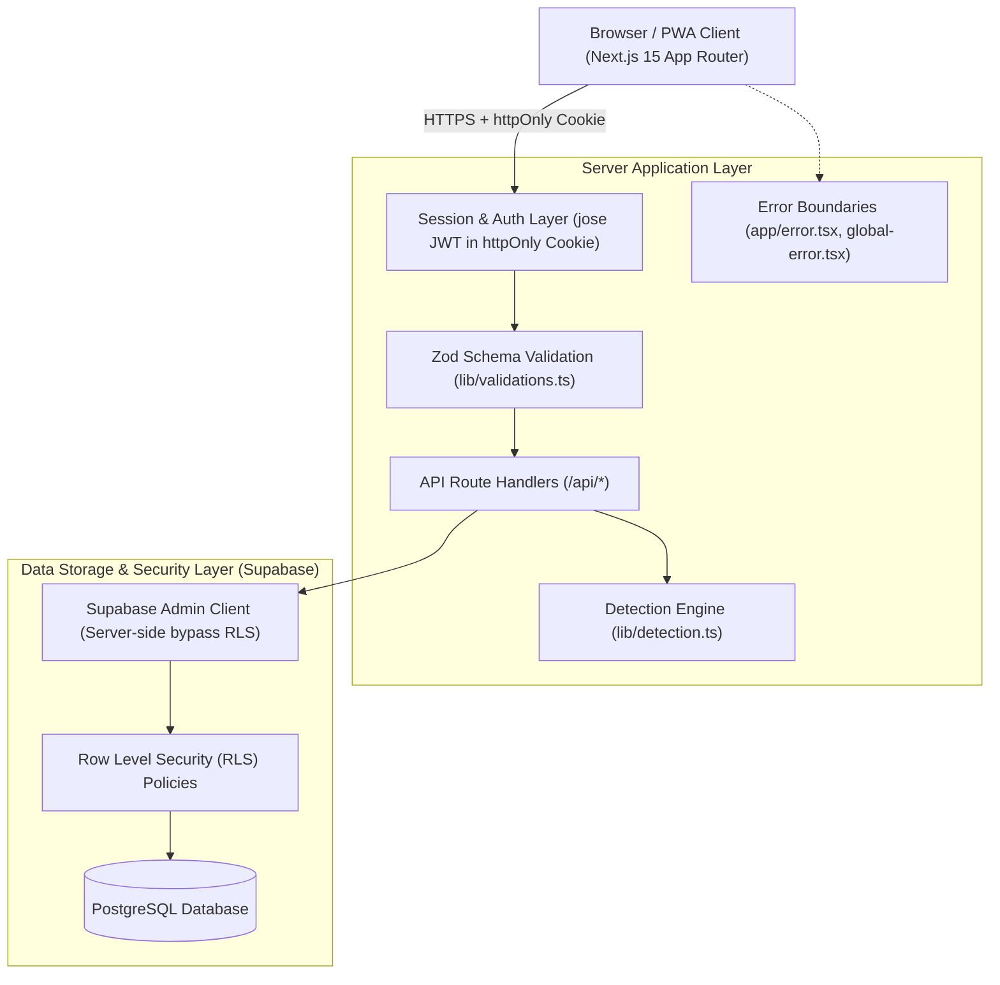
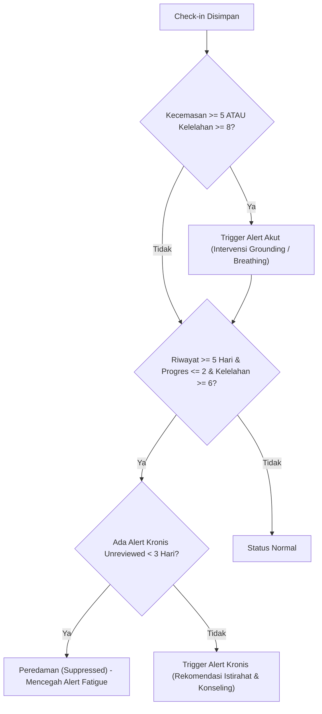
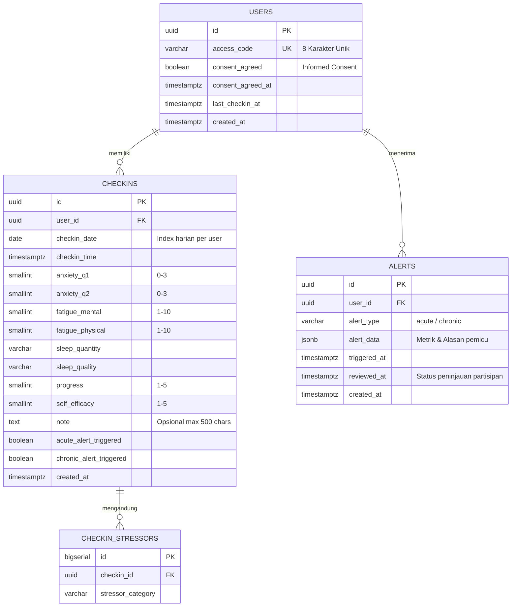

# 🏗️ JEDA v2 Architecture & Technical Design

## 1. Ringkasan Eksekutif
**Jeda** adalah aplikasi web Ecological Momentary Assessment (EMA) untuk pemantauan stres, kelelahan, dan progres pengerjaan skripsi mahasiswa secara berkala dan anonim. Sistem dirancang dengan prinsip **Privacy-by-Design**, di mana identitas pribadi (nama, NIM, email) tidak pernah disimpan di database.

---

## 2. Diagram Arsitektur Sistem

---

## 3. Komponen Utama

### A. Authentication & Session Model
- **Identifikasi Partisipan:** Kode akses alfanumerik 8 karakter acak (contoh: `K7M2P9X4`) tanpa password atau data identitas diri.
- **Session Token:** JSON Web Token (JWT) yang di-sign menggunakan algoritma `HS256` dengan kunci `JWT_SECRET`.
- **Penyimpanan:** Disimpan eksklusif di dalam cookie `httpOnly`, `SameSite=Lax`, dan flag `Secure` saat environment production. Hal ini mencegah serangan XSS (*Cross-Site Scripting*).

### B. Ecological Momentary Assessment (EMA) Engine
Sistem mengumpulkan 9 item data multidimensi setiap check-in:
1. `anxiety_q1`: Merasa gugup, cemas, atau gelisah (0–3, adaptasi GAD-2).
2. `anxiety_q2`: Tidak mampu menghentikan atau mengendalikan rasa cemas (0–3, adaptasi GAD-2).
3. `fatigue_mental`: Kelelahan mental/pikiran (1–10, adaptasi Chalder Fatigue Scale).
4. `fatigue_physical`: Kelelahan fisik/badan (1–10, adaptasi Chalder Fatigue Scale).
5. `sleep_quantity`: Estimasi jam tidur (<5, 5-6, 6-7, 7-8, >8 jam).
6. `sleep_quality`: Kualitas tidur (buruk, cukup, baik).
7. `progress`: Persepsi kemajuan skripsi hari ini (1–5).
8. `self_efficacy`: Keyakinan menyelesaikan target esok hari (1–5).
9. `stressors`: Kategori sumber stres (teknis, bimbingan, waktu, infrastruktur, personal).

---

## 4. Algoritma Deteksi & Intervensi (PRD Appendix B)

### A. Alert Akut (Kondisi Kritis Saat Ini)
* **Kriteria:**
  $$\text{Kecemasan Gabungan} = \text{anxietyQ1} + \text{anxietyQ2} \ge 5$$
  *ATAU*
  $$\text{Rata-rata Kelelahan} = \frac{\text{fatigueMental} + \text{fatiguePhysical}}{2} \ge 8.0$$
* **Respons Sistem:** Menampilkan modal intervensi relaksasi instan (teknik pernapasan 4-7-8, grounding 5-4-3-2-1).

### B. Alert Kronis (Burnout / Kebuntuan Berkepanjangan)
* **Kriteria:**
  - Minimal memiliki riwayat 5 hari check-in terakhir berturut-turut.
  - Rata-rata indeks progres 5 hari $\le 2.0$.
  - Rata-rata indeks kelelahan 5 hari $\ge 6.0$.
* **Mekanisme Peredaman (Suppression Mechanism):**
  Jika sudah terdapat alert kronis yang dipicu dalam 3 hari terakhir dan belum ditinjau (`reviewed_at IS NULL`), sistem **tidak akan** memicu alert kronis baru untuk mencegah kejenuhan notifikasi (*alert fatigue*).

---

## 5. Skema Database (Entity Relationship Diagram)

